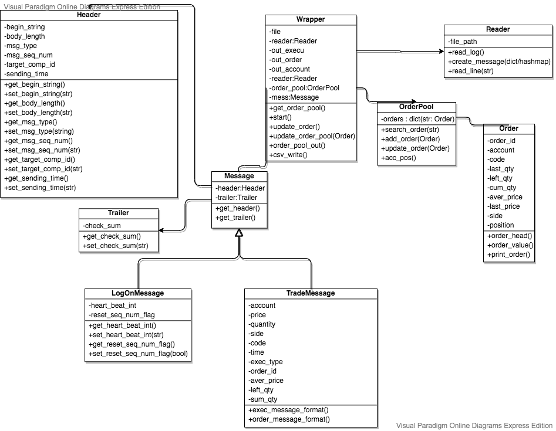

- [ Answers](#head26)
	- [ Q1](#head27)
	- [ Q2](#head28)
		- [1.The orders that the account sent](#head29)
		- [2.The account’s positions now](#head30)
	- [ Q3](#head31)
		- [Proceed the investigation](#head32)
		- [Bugs find in log files](#head33)
			- [1.log content format](#head34)
			- [2.FIX body length not correct](#head35)
			- [3.check sum not correct](#head36)
			- [4.Precision of trascation time](#head37)
- [FIX log file constructor](#head1)
- [Folder Structure](#head2)
- [Design UML](#head3)
- [ Description](#head4)
	- [Input Data Foprmat](#head5)
		- [ Header](#head6)
		- [ Trailer](#head7)
		- [1. Heart Beat / Log Out](#head8)
		- [2. Log On](#head9)
		- [3. Trade / New Order](#head10)
	- [Enviroment Set Up](#head11)
		- [ requirement](#head12)
			- [1.python 3.7.1](#head13)
			- [2. pip](#head14)
			- [3. requirement.txt](#head15)
		- [OS X & Linux install](#head16)
	- [Run Program](#head17)
		- [1. Reconstruct log file](#head18)
		- [2. Run unit tests](#head19)
		- [3. Run bug investagetion](#head20)
	- [Output Description](#head21)
		- [1. execu.csv -- the executed transactions](#head211)
		- [2. order.csv -- the orders that the account sent](#head22)
		- [3.account_position.csv -- The account’s positions now](#head23)
		- [4.test_report.txt -- unit tests report](#head24)
		- [5.bugs_report.txt -- bugs located for customers](#head25)

# <span id="head1">FIX log file constructor</span>
> Given the FIX log file extracted from integration testing, reconstruct the log file.

This is an efficient python implementation of reconstructing a standard FIX (Financial Information Exchange) log data messages from the platform build for a brokerage client.
<https://www.onixs.biz/fix-dictionary/4.4/index.html>
For a short definition of trading and positions to understand the log data <https://www.quora.com/What-is-the-difference-between-Orders-Trades-and-Positions-in-Forex-trading#:~:text=A%20position%20is%20exposure%20to,now%20you%20sell%20to%20close.>
 The program outputs 3 csv files containing the orders made by customer, executed trade transactions and the related account position of the relative orders.
#github link
<https://github.com/Joannazhx/FIX_wrapper/>
# <span id="head2">Folder Structure</span>
```
FIX_wrapper
│
└─── src
│     │
│     └─── wrapper.py     (process log file)
│     │
│     └─── reader.py      (process data line by line)
│     │
│     └─── order.py       (order)
│     │
│     └─── order_pool.py  (order pool)
│     │
│     └─── message.py     (message)
│     │
│     └─── const.py       (const variables)
│     │
│     └─── main.py        (parser / entrance)
│
└─── unit_test
│   	 │
│   	 └─── order_test.py           (Order unit test cases)
│   	 │
│   	 └─── order_pool_test.py      (OrderPool unit test cases)
│   	 │
│   	 └─── message_test.py         (Message unit test cases)
│   	 │
│   	 └─── reader_test.py          (Reader unit test cases)
│   	 │
│   	 └─── test_wrap.py            (unit test execution-automatic loading)
│   	 │
│   	 └─── bugs_tests.py            (investage bugs)
│   	 │
│   	 └─── logs_test.py            (log files unit test cases)
│   	 │
│   	 └─── test_logs
│   	 		  │
│   	 		  └─── test1.txt / test2.txt   (input log files for test)
│   	 		  │
│   	 		  └─── output_1 / output_2     (test cases expected results)
│   	 		  		  │
│   	 		  		  └─── account_position.csv
│   	 		  		  │
│   	 		  		  └─── orders.csv
│   	 		  		  │
│   	 		  		  └─── execu.csv
│
└─── input
│      │
│      └─── FIX.09-Jan-2018.log   (input log file)
│
└─── output   (output files)
│   	│
│   	└─── account_position.csv  	(account position)
│   	│
│   	└─── orders.csv		    	(customer order)
│   	│
│       └─── execu.csv			    (executed transactions)
│   	│
│       └─── test_report.txt	   	(unit test report)
│   	│
│       └─── bugs_report.txt	   	(bugs test report)
│
└─── Design (UML design)
│
└─── requirement.txt  (python package versions)

```
# <span id="head3">Design UML</span>

# <span id="head4"> Description</span>
This program aims to analysis log file from integration testing, the test platform using standard FIX (Financial Information Exchange) protocol to instruct the client’s system to send orders and return the execution results. This platform receives orders from customer and make transcations.This program is able to reconstruct the log file and analysis orders and trade.
## <span id="head5">Input Data Foprmat</span>
Every type include header and trailer
### <span id="head6"> Header</span>
```
	    +   -HEADER
    	|   8 @begin_string      = FIX.4.4
    	|   9 @body_length       = 178
    	|   35 @msg_type         = Logon (A)
    						   	   Logout (5)
                                   Heart beat (0)
                                   Execution Report (8)
    	|   34 @msg_seq_num      = 1
    	|   49 @sender_comp_id   = testusr4109
    	|   52 @sending_time     = 20101124-20:27:25.000
    	|   56 @target_comp_id   = WIKIPEDIA
```
### <span id="head7"> Trailer</span>
```
    	|   10  @check_sum         = 133
```

### <span id="head8">1. Heart Beat / Log Out</span>
```
        @header
        @trailer
```
Heart beat\
8=FIX.4.4	|	9=55	|	35=0	|	34=9	|	49=FIXSIM|52=20180109-00:03:33.438	|	56=QFSAMPLE	|	10=067	| \

LogOut\
8=FIX.4.4	|	9=55	|	35=5	|	34=1	|	49=FIXSIM	|	52=20180109-04:56:33.624	|	56=QFSAMPLE	|	10=073	| \

### <span id="head9">2. Log On</span>
```
	@header
        +   BODY
        |  108 @heart_beat_int       = 300
        |  141 @reset_seq_num_flag   = Y
        @trailer
```
LogOn \
8=FIX.4.4	|	9=73	|	35=A	|	34=1	|	49=FIXSIM	|	52=20180109-00:00:03.618	|	56=QFSAMPLE	|	98=0	|	108=30	|	141=Y	|	10=140	| \

### <span id="head10">3. Trade / New Order</span>
```
	@header
        +   BODY
        |   1    @account        = TEST1234
        |   31   @price          = 25
        |   32   @quantity       = 3
        |   54   @side           = 1 (Buy)
        						   2 (Sell)
        |   55   @code           = 0700
        |   60   @time           = 20180109-07:01:07
        |   150  @exec_type      = 0 (New)
        						   F (Trade partial fill / fill)
        |   11   @order_id       = 30636510780671786000
        |   6    @aver_price     = 25
        |   151  @left_qty       = 50
        |   14   @sum_qty        = 50
        @trailer
```
New Order\
8=FIX.4.4	|	9=232	|	35=8	|	34=242	|	49=FIXSIM|52=20180109-07:01:01.905	|	56=QFSAMPLE	|	1=TEST1234	|	6=0	|	11=QO37NA54U3C8NTYKHDT15N4_0	|	14=0	|	17=2636510780617342000	|	31=0	|	32=0	|	37=2636510780617342000	|	38=100	|	39=0	|	54=1	|	55=0700	|	60=20180109-07:01:01	|	150=0	|	151=100	|	207=HKE	|	10=226	| \
Trade\
8=FIX.4.4	|	9=235	|	35=8	|	34=249	|	49=FIXSIM|52=20180109-07:01:04.214	|	56=QFSAMPLE	|	1=TEST1234	|	6=25	|	11=QO37NA54U3C8NTYKHDT15N4_0	|	14=50	|	17=9636510780641834000	|	31=25	|	32=50	|	37=9636510780641834000	|	38=100	|	39=1	|	54=1	|	55=0700	|	60=20180109-07:01:04	|	150=F	|	151=50	|	207=HKE	|	10=194	| \
## <span id="head11">Enviroment Set Up</span>
### <span id="head12"> requirement</span>
#### <span id="head13">1.python 3.7.1</span>
<https://www.python.org/downloads/release/python-371/>
Recommand to use virtual enviroment, for more information in how to use virtualenwrapper to create a python virtual enviroment
<https://virtualenvwrapper.readthedocs.io/en/latest/index.html>
#### <span id="head14">2. pip</span>
<https://www.liquidweb.com/kb/install-pip-windows/>
#### <span id="head15">3. requirement.txt</span>
```
numpy==1.19.0
pandas==1.1.1
pep8==1.7.1
pylint==2.6.0
```

### <span id="head16">OS X & Linux install</span>
```
workon <python3_virtual_env_name>
pip install -r requirement.txt
```

## <span id="head17">Run Program</span>
### <span id="head18">1. Reconstruct log file</span>
To reconstruct the log we can run src/main.py which has the following usage:

```
usage:    python src/main.py -f log_file [-o] output dir
		  python src/main.py -f input/FIX.09-Jan-2018.log -o output/
          python src/main.py -f input/FIX.09-Jan-2018.log
 -h, --help     Display usage instructions
 -f, --file     Drag log file here/input file path
 -o, --out_dir  Output files dir , default=output/
```

### <span id="head19">2. Run unit tests</span>
To run all unit tests
```
usage:    python unit_test/test_wrap.py
```
### <span id="head20">3. Run bug investagetion</span>
To find what's might be wrong
```
usage:    python unit_test/bugs_tests.py
```
## <span id="head21">Output Description</span>
### <span id="head211">1. execu.csv -- the executed transactions</span>

| OutputStock Code | Transaction Quantity |	Transaction Price |	Transaction Side |	Account | Transaction Reference ID | Transaction Time |
|------------------|----------------------|-------------------|------------------|----------|----------------------------|------------------|
|	0992 |	1000 |	25	|  buy	| TEST1234  | QO37NA54U3C8NTZ70I315N5_0 | 20180109-07:01:03 |
|	1357 |	500	 |  25	|  buy	| TEST1234	| QO37NA54U3C8NU0LOVQ15N7_0	| 20180109-07:01:03 |
|	0992 |	500	 |  25	|  buy	| TEST1234	| QO37NA54U3C8NTZ70I315N5_0	| 20180109-07:01:04 |
|	0700 |	50	 |  25	|  buy	| TEST1234	| QO37NA54U3C8NTYKHDT15N4_0	| 20180109-07:01:04 |
|	1357 |	250  |	25	|  buy	| TEST1234	| QO37NA54U3C8NU0LOVQ15N7_0	| 20180109-07:01:04 |
|	981  |	500  |	25	|  buy	| TEST1234	| QO37NA54U3C8NTZWKRD15N6_0	| 20180109-07:01:04 |
|	981  |	250	 |  25	|  buy	| TEST1234	| QO37NA54U3C8NTZWKRD15N6_0	| 20180109-07:01:04 |
|	1357 |	125	 |  25	|  buy	| TEST1234	| QO37NA54U3C8NU0LOVQ15N7_0	| 20180109-07:01:04 |
|	1357 |	62	 |  25	|  buy	| TEST1234	| QO37NA54U3C8NU0LOVQ15N7_0	| 20180109-07:01:04 |
|	...  |	...	 |  ... |  ...	|    ... 	| 			...				| 		...			|
### <span id="head22">2. order.csv -- the orders that the account sent</span>
| Stock Code |	Account |Total Quantity|Transaction Side| Transaction Reference ID  | Transaction Time  |
|------------|----------|--------------|----------------|---------------------------|-------------------|
|	0700	 | TEST1234 |	   100	   |       buy	    | QO37NA54U3C8NTYKHDT15N4_0 | 20180109-07:01:01 |
|	0992     | TEST1234	|     2000	   |       buy		| QO37NA54U3C8NTZ70I315N5_0	| 20180109-07:01:02 |
|	981      | TEST1234	|     1000	   |	   buy		| QO37NA54U3C8NTZWKRD15N6_0	| 20180109-07:01:02 |
|	1357     | TEST1234	|     1000	   |       buy	    | QO37NA54U3C8NU0LOVQ15N7_0	| 20180109-07:01:02 |
### <span id="head23">3.account_position.csv -- The account’s positions now</span>
| order_id	 | account_num	| code	| last_qty	| left_qty | cum_qty | aver_price | last_price | side |	position |
|------------|--------------|-------|-----------|----------|---------|------------|------------|-------|-------------|
| QO37NA54U3C8NTYKHDT15N4_0 | TEST1234 | 0700 | 1 |	0 |	100  | 25 | 25 | buy | closed |
| QO37NA54U3C8NTZ70I315N5_0	| TEST1234 | 0992 |	1 |	0 |	2000 | 25 |	25 | buy | closed |
| QO37NA54U3C8NTZWKRD15N6_0	| TEST1234 | 981  |	1 |	0 |	1000 | 25 |	25 | buy | closed |
| QO37NA54U3C8NU0LOVQ15N7_0	| TEST1234 | 1357 |	1 |	0 |	1000 | 25 |	25 | buy | closed |
### <span id="head24">4.test_report.txt -- unit tests report</span>
```
testtest_log1 (logs_test.TestLogs) ... ok
test_log2 (logs_test.TestLogs) ... ok
test_exec_message_format (message_test.TestMessage) ... ok
test_header_gets (message_test.TestMessage) ... ok
test_header_sets (message_test.TestMessage) ... ok
test_log_on_gets (message_test.TestMessage) ... ok
test_log_on_sets (message_test.TestMessage) ... ok
test_order_message_format (message_test.TestMessage) ... ok
test_trade_message_gets (message_test.TestMessage) ... ok
test_trade_message_sets (message_test.TestMessage) ... ok
test_trailer_gets (message_test.TestMessage) ... ok
test_trailer_sets (message_test.TestMessage) ... ok
test_add_order_to_pool (order_pool_test.TestOrderPool) ... ok
test_serach_order_pool (order_pool_test.TestOrderPool) ... ok
test_update_order_to_pool (order_pool_test.TestOrderPool) ... ok
test_order_gets (order_test.TestOrder) ... ok
test_order_headers (order_test.TestOrder) ... ok
test_order_print_order (order_test.TestOrder) ... ok
test_order_set_position (order_test.TestOrder) ... ok
test_order_value (order_test.TestOrder) ... ok
test_reader_create_mess_heart (reader_test.TestReader) ... ok
test_reader_create_mess_logon (reader_test.TestReader) ... ok
test_reader_create_mess_trade (reader_test.TestReader) ... ok
test_reader_read_line (reader_test.TestReader) ... ok

----------------------------------------------------------------------
Ran 24 tests in 0.311s

OK

```
### <span id="head25">5.bugs_report.txt -- bugs located for customers</span>
```
test_check_sum (bugs_test.TestBugs) ... FAIL
test_fix_format (bugs_test.TestBugs) ... FAIL
test_length (bugs_test.TestBugs) ... FAIL
test_trade_price (bugs_test.TestBugs) ... ok
test_trade_qtys (bugs_test.TestBugs) ... ok

======================================================================
FAIL: test_check_sum (bugs_test.TestBugs)
----------------------------------------------------------------------
Traceback (most recent call last):
  File "/Users/joanna/Desktop/jobs/OnGoing/quantifeed/unit_test/bugs_test.py", line 47, in test_check_sum
    self.assertEqual(int(mess.get_trailer().get_check_sum()), sys.getsizeof(line) % 256)
AssertionError: 55 != 128

======================================================================
FAIL: test_fix_format (bugs_test.TestBugs)
----------------------------------------------------------------------
Traceback (most recent call last):
  File "/Users/joanna/Desktop/jobs/OnGoing/quantifeed/unit_test/bugs_test.py", line 31, in test_fix_format
    self.assertEqual(messages[0], '8=FIX.4.4')
AssertionError: "# Opened at '1/9/2018 6:19:53 PM' (current recvSeqno=1643, sendSeqno=1600)\n" != '8=FIX.4.4'
- # Opened at '1/9/2018 6:19:53 PM' (current recvSeqno=1643, sendSeqno=1600)
+ 8=FIX.4.4

======================================================================
FAIL: test_length (bugs_test.TestBugs)
----------------------------------------------------------------------
Traceback (most recent call last):
  File "/Users/joanna/Desktop/jobs/OnGoing/quantifeed/unit_test/bugs_test.py", line 39, in test_length
    self.assertEqual(mess.get_header().get_body_length(), len(line))
AssertionError: 73 != 76

----------------------------------------------------------------------
Ran 5 tests in 0.074s
FAILED (failures=3)
```
# <span id="head26"> Answers</span>
## <span id="head27"> Q1</span>
From the file, please extract the executed transactions and output a CSV file
output/execu.csv
[execu.csv description](#head211)

## <span id="head28"> Q2</span>
The program keeps track of orders' after every trade. When an order is created by the customer, it will be added to the order pool. When a trade is exacuated, it will update the corresponding order in order pool(based on unique order id). If the orders' left quantity equal to 0, that means the order is fully traded and the position of the order is closed.

### <span id="head29">1.The orders that the account sent</span>
output/orders.csv
[orders.csv description](#head22)

### <span id="head30">2.The account’s positions now</span>
 output/account_position.csv
[account_position.csv description](#head23)

## <span id="head31"> Q3</span>
### <span id="head32">Proceed the investigation</span>
First, I will look at the release report of the platform version customer uses and run the test cases again. To see are there any known bugs that may affect these problems.
Secondly, I will look at the mnost recent log files to see is there any instict bugs. Later, I will build new test cases based on the log files and run it to repeat customer's ueser actions.After I locate the potential(unknown) bugs, I will communicate to developers' team to discuss about the solutions that might work.
Then, I will reach to the customer to find out what's the wrong she experienced and give her a brief solution we could offer.Later, I will write a report to explain the situation and discuss it with developers' team to carry out and give customer an update.
### <span id="head33">Bugs find in log files</span>
unit_test/bugs_test.py desined test cases for locate bugs
[bugs_report.txt description](#head25)
#### <span id="head34">1.log content format</span>
One line in log file not in FIX standard format
```
	# Opened at '1/9/2018 6:19:53 PM' (current recvSeqno=1643, sendSeqno=1600)
	+ 8=FIX.4.4
```
#### <span id="head35">2.FIX body length not correct</span>
FIX feild <9> not equal to body length
```
	35=A|34=1|49=FIXSIM|52=20180109-00:00:03.618|56=QFSAMPLE|98=0|108=30|141=Y|
    self.assertEqual(mess.get_header().get_body_length(), len(line))
	AssertionError: 73 != 76
```
#### <span id="head36">3.check sum not correct</span>
FIX feild <10> not correct
```
	8=FIX.4.4|9=61|35=0|34=2|49=FIXSIM|52=20180109-00:00:03.852|56=QFSAMPLE|112=2|
    self.assertEqual(int(mess.get_trailer().get_check_sum()), sys.getsizeof(line) % 256)
	AssertionError: 55 != 128
```
#### <span id="head37">4.Precision of trascation time</span>
the precision of trascatio time better to be same as sending time to increase accuracy

```
	52=20180109-07:01:09.565 -- sending time
    60=20180109-07:01:09     -- transaction time 
```

